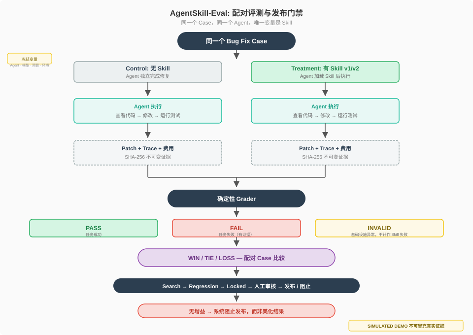
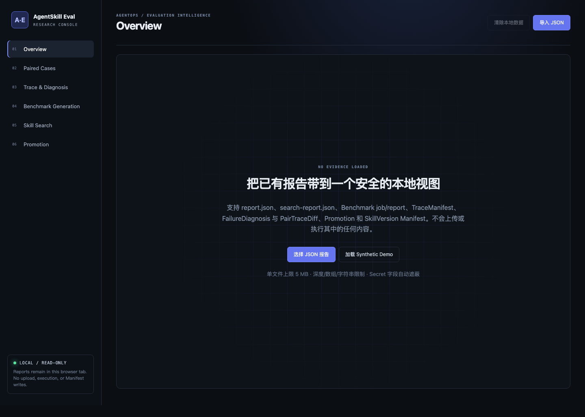
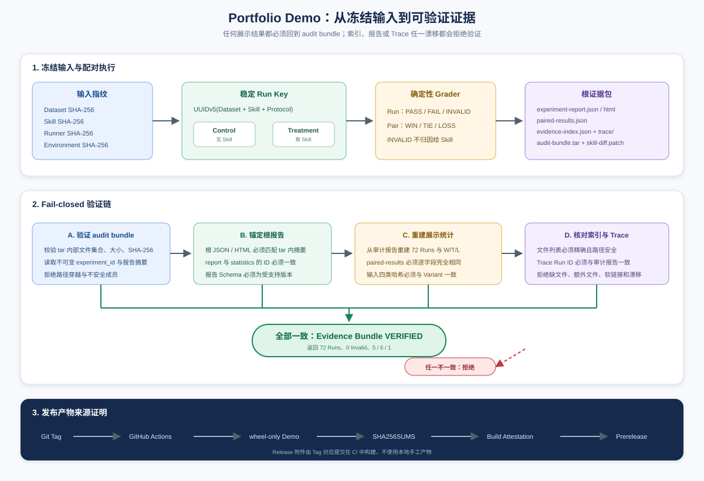

# AgentSkill-Eval

[](./pyproject.toml)
[](./LICENSE)
[](https://github.com/still0123/AgentSkill-Eval-Refined/actions/workflows/ci.yml)
[](https://github.com/still0123/AgentSkill-Eval-Refined/releases/tag/v0.3.0-rc.3)

AgentSkill-Eval 是一个面向 Agent Skill 的**配对评测与发布门禁系统**。它解决的核心问题是：

> 如何知道一个 Skill 是否真的带来了增益？

系统在冻结 Agent、模型、Case、环境和预算的前提下，**同题双跑** Control（无 Skill / v1）和 Treatment（有 Skill / v2），通过确定性判分、证据归档和分阶段数据集判断新 Skill 是否值得发布。

> **AgentSkill-Eval-Refined** 是 AgentSkill-Eval 的聚焦公开版本，保留 Python Bug Fix Skill 评测主线，移除尚未形成真实证据的 MCP、Memory/RAG 和平台化扩展。
> 原始完整研究版见 [ranmaoxia0123/AgentSkill-Eval](https://github.com/ranmaoxia0123/AgentSkill-Eval)。

当前 Portfolio Release：[`v0.3.0-rc.3`](https://github.com/still0123/AgentSkill-Eval-Refined/releases/tag/v0.3.0-rc.3)。

## 核心流程



```
冻结输入 → 配对执行 → 确定性验收 → 失败诊断 → 候选搜索 → 回归验证 → 独立终评 → 人工审核 → 发布
```

### 四层评测标准

| 层级 | 判定 | 含义 |
|---|---|---|
| 单次 Run | PASS / FAIL / INVALID | 确定性 Grader 判定，INVALID 表示基础设施异常 |
| 配对 Case | WIN / TIE / LOSS | 同题 Control vs Treatment 比较 |
| 实验统计 | AbsoluteGain + 95% CI | 两级 cluster bootstrap，样本不足时标记 `inference_ready=false` |
| 版本发布 | 五阶段门禁 | Search → Regression → Confirm → Locked → 人工审核 |

### 评测场景

当前支持两条最小软件工程评测线：

- **Python Bug Fix**：从真实 Git 历史重建缺陷 Case，通过 before-fail / after-pass /
  mutation-fail / alternative-pass 四态验证 Oracle；
- **Python Test Generation**：要求 Agent 只写回归测试，Grader 验证生成测试在 before commit
  失败、after commit 通过，并拒绝生产代码修改。

## 快速开始

### 方式一：安装 Release wheel（推荐）

wheel 已内置离线 Demo Dataset 与 Skill，不要求 clone 源码，也不需要 API Key。

```bash
python3 -m venv .venv
source .venv/bin/activate
python3 -m pip install \
  https://github.com/still0123/AgentSkill-Eval-Refined/releases/download/v0.3.0-rc.3/agentskill_eval-0.3.0rc3-py3-none-any.whl

agentskill-eval demo run \
  --workspace .agentskill-eval/portfolio-demo
agentskill-eval demo verify \
  --workspace .agentskill-eval/portfolio-demo
```

### 方式二：源码开发

```bash
git clone https://github.com/still0123/AgentSkill-Eval-Refined.git
cd AgentSkill-Eval-Refined
python3 -m pip install -e ".[dev]"
```

## 演示结果

以下是一组真实 Demo 输出（零费用，完全离线模拟）：

```text
12 Cases × 2 Arms × 3 Repeats = 72 Runs
Invalid: 0
W/T/L: 5 / 6 / 1
Evidence Bundle: VERIFIED
Cost: $0
Evidence Class: SIMULATED DEMO
```



Demo 证据包包含：

| 文件 | 说明 |
|---|---|
| `experiment-report.json` | 完整实验报告 |
| `experiment-report.html` | 离线可打开的 HTML 报告 |
| `paired-results.json` | 配对 Case 对比结果 |
| `evidence-index.json` | 全部 Run 的索引与证据分类 |
| `audit-bundle.tar` | SHA-256 审计包 |
| `skill-diff.patch` | Simulated Demo 占位说明；不冒充真实 Skill v2 diff |
| `trace/` | Agent 执行 Trace 集合 |

> **注意**：Demo 标记为 `SIMULATED DEMO`，所有结果均为确定性 fixture，不代表真实 Agent 或 Skill 性能。

相同输入会生成稳定 Experiment ID。在同一 workspace 重跑时复用已有实验，不新增实验目录，
也不会把根证据包覆盖成另一组结果。

## 真实 Skill v1 → v2 结果

2026-08-05 的受限 observed-Agent 实验在五个独立开源仓库 Case 上完成首个正向闭环：

```text
Train: v1 produced one valid task failure
Validation Search: v1 FAIL → v2 PASS (WIN)
Regression / Confirmation / Locked: 0 LOSS, 0 INVALID
Aggregate Search→Locked W/T/L: 1 / 3 / 0
Promotion Gate: PASSED
Published SkillVersion: python-bug-fix@2.0.0
Evidence class: OBSERVED / DESCRIPTIVE
```

Skill v2 只增加一条通用规则：修改后必须重新运行复现命令，失败时继续迭代，不能在没有通过证据
时结束。它不包含 Case ID、仓库名、代码路径、补丁或答案。样本只有 4 个独立评测 Case，且均
来自公开 Git 历史；该结果证明一次可审计的工程闭环，不代表普遍性能提升。

第二条 **Python Test Generation** family 只评测 2 个 Case。最终有效配对为
`W/T/L = 0 / 2 / 0`、`INVALID = 0`：without-Skill 和 with-Skill 都未生成满足
before-fail / after-pass Oracle 的测试。后验 Trace 诊断发现该实验复用了 Bug Fix 专用
Process Agent，且 Treatment Skill 未进入模型上下文，因此这 4 个 Run 保留为真实任务失败，
但不再解释为 Test Generation Skill 无效的因果证据；未触发自动优化或版本发布。

详见 [真实正向闭环报告](docs/real-positive-skill-loop.md)和
[Test Generation 负结果诊断](docs/test-generation-negative-result-diagnosis.md)。

## 证据为什么可信

`demo verify` 不信任展示层 JSON，而是以 `audit-bundle.tar` 的内部 Manifest 为锚点，
交叉核对 Experiment ID、根报告摘要、W/T/L、Trace 集合、文件集合和四类输入哈希。



验证采用 fail-closed 语义：

- `evidence-index.json` 缺文件、多文件、路径越界或软链接时拒绝；
- `paired-results.json` 与审计报告统计不一致时拒绝；
- 根 JSON/HTML 与 audit bundle 内摘要不一致时拒绝；
- Dataset、Skill、Runner、Environment 任一哈希漂移时拒绝；
- `simulated=true` 或 `SIMULATED_DEMO` 标记缺失时拒绝。

真实 Agent 实验不复用 Portfolio Demo 入口，必须通过预算授权的
`real preflight`、`real smoke` 或 `real run` 命令执行。

## Release 完整性

Tag Release 由 GitHub Actions 自动构建。wheel、sdist、Demo evidence bundle、图稿和演示文档
均附带 `SHA256SUMS`，核心发布物同时生成 GitHub build provenance。

```bash
gh release download v0.3.0-rc.3 \
  --repo still0123/AgentSkill-Eval-Refined \
  --dir release

cd release
shasum -a 256 -c SHA256SUMS
gh attestation verify agentskill_eval-0.3.0rc3-py3-none-any.whl \
  --repo still0123/AgentSkill-Eval-Refined
```

## 五分钟演示

参阅 [docs/five-minute-demo.md](docs/five-minute-demo.md) 获取完整的面试讲解流程。

## CLI 命令

```
agentskill-eval [OPTIONS] COMMAND

  demo run         运行演示实验
  dataset validate 验证数据集
  benchmark generate/publish  生成/发布 Benchmark
  optimize search/prepare-failures  候选搜索与失败导出
  final evaluate   独立终评
  skill promote begin/confirm/locked/approve/reject  Skill 版本发布
  real preflight/smoke/run  真实 Agent 实验
  scenario validate/run  软件工程场景验证与执行
```

## 项目结构

```
AgentSkill-Eval/
├── apps/cli/                 # CLI 入口
├── packages/
│   ├── contracts/            # Pydantic 领域模型
│   ├── experiment/           # 配对执行、统计、存储
│   ├── benchmark_gen/        # Git 历史 Benchmark 重建
│   ├── skill_optimizer/      # 候选搜索、终评、发布
│   ├── runner_adapters/      # Runner 防腐层
│   ├── real_evidence/        # 真实 Agent 证据
│   ├── scenarios/            # 聚焦的软件工程场景协议
│   └── trace_intelligence/   # Trace 与失败诊断
├── tests/                    # 单元 + 集成测试
└── examples/                 # 配置与数据集示例
```

## 技术栈

| 领域 | 选择 |
|---|---|
| 核心语言 | Python 3.9+ |
| CLI | Typer / Click |
| 领域契约 | Pydantic v2 |
| 存储 | 本地内容寻址 Blob + SHA-256 |
| 评测 | 确定性 Grader + 两级 cluster bootstrap |
| 工程质量 | Ruff, mypy, pytest, GitHub Actions |
| 发布可信度 | SHA256SUMS + GitHub build provenance |

## 核心设计原则

- **控制变量**：PairBlock 固定执行顺序和环境，只改变 Skill
- **失败即证据**：任务失败、基础设施 invalid、预算终止使用不同语义
- **数据防泄漏**：同源仓库按 exposure zone 隔离，locked test 只消费一次
- **诚实的能力声明**：缺少事件标记 unavailable，样本不足限制 claim
- **负结果保留**：无增益时系统阻止发布，而非美化结果

## 当前边界

- Python Test Generation 仅有最小两 Case 配对评测，当前结果受 Runtime/Skill handoff
  混杂，尚不能评价 Skill 效果
- 真实实验样本较小，不支持通用性能排名
- Dashboard 只读本地证据
- 已发布的真实 Skill v2 结论仅适用于冻结 Agent、公开 Case、Runtime 与协议

## License

Apache License 2.0
